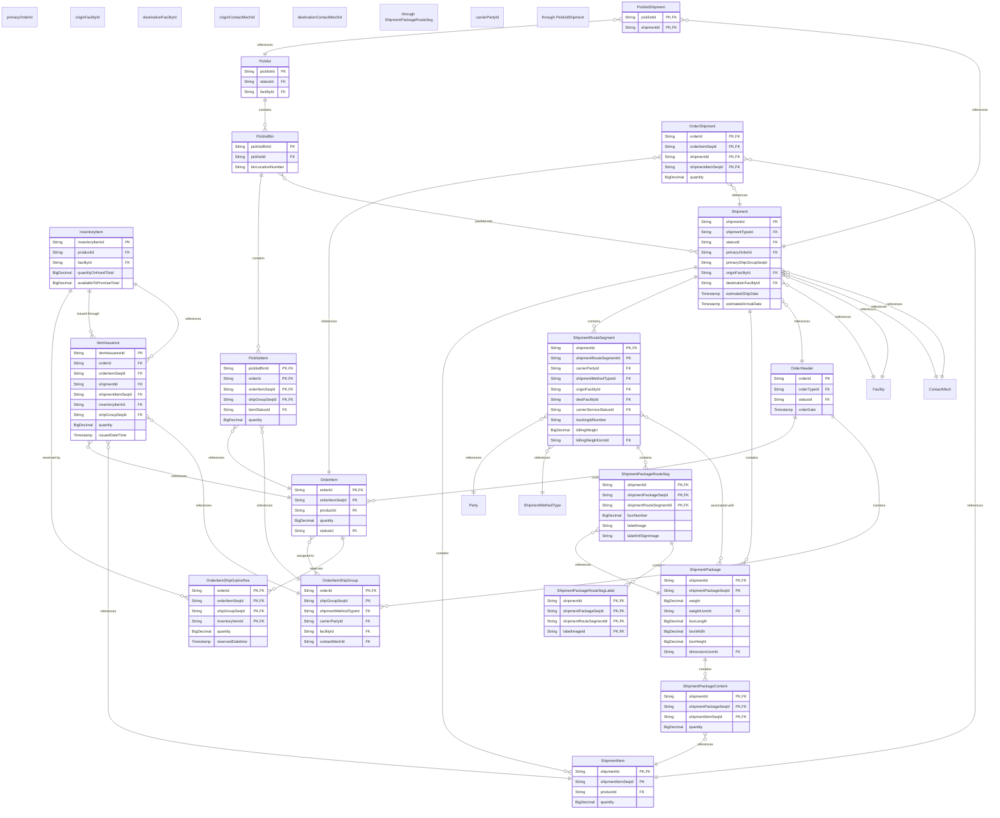

```mermaid
erDiagram
    %% ENTITY RELATIONSHIP DIAGRAM FOR OUTBOUND SHIPMENT PROCESS
    
    %% Order entities
    OrderHeader ||--o{ OrderItem : contains
    OrderHeader ||--o{ OrderItemShipGroup : contains
    OrderItem }o--o{ OrderItemShipGroup : assigned-to
    OrderItem ||--o{ OrderItemShipGrpInvRes : reserves
    
    %% Picklist entities
    Picklist ||--o{ PicklistBin : contains
    PicklistBin ||--o{ PicklistItem : contains
    PicklistItem }o--|| OrderItem : references
    PicklistItem }o--|| OrderItemShipGroup : references
    
    %% Inventory entities
    InventoryItem ||--o{ OrderItemShipGrpInvRes : reserved-by
    InventoryItem ||--o{ ItemIssuance : issued-through
    
    %% Shipment entities
    Shipment ||--o{ ShipmentItem : contains
    Shipment ||--o{ ShipmentRouteSegment : contains
    Shipment ||--o{ ShipmentPackage : contains
    Shipment }o--|| OrderHeader : references "primaryOrderId"
    Shipment }o--|| Facility : references "originFacilityId"
    Shipment }o--|| Facility : references "destinationFacilityId"
    Shipment }o--|| ContactMech : references "originContactMechId"
    Shipment }o--|| ContactMech : references "destinationContactMechId"
    
    %% Shipment package entities
    ShipmentPackage ||--o{ ShipmentPackageContent : contains
    ShipmentPackageContent }o--|| ShipmentItem : references
    ShipmentPackage }o--o{ ShipmentRouteSegment : associated-with "through ShipmentPackageRouteSeg"
    
    %% Shipment route segment entities
    ShipmentRouteSegment }o--|| Party : references "carrierPartyId"
    ShipmentRouteSegment }o--|| ShipmentMethodType : references
    ShipmentRouteSegment ||--o{ ShipmentPackageRouteSeg : contains
    ShipmentPackageRouteSeg }o--|| ShipmentPackage : references
    ShipmentPackageRouteSeg ||--o{ ShipmentPackageRouteSegLabel : contains
    
    %% Picklist-Shipment relationship
    PicklistBin }o--o{ Shipment : packed-into "through PicklistShipment"
    PicklistShipment }o--|| Picklist : references
    PicklistShipment }o--|| Shipment : references
    
    %% Order-Shipment relationship
    OrderShipment }o--|| OrderItem : references
    OrderShipment }o--|| Shipment : references
    OrderShipment }o--|| ShipmentItem : references
    
    %% Issuance entities
    ItemIssuance }o--|| OrderItem : references
    ItemIssuance }o--|| ShipmentItem : references
    ItemIssuance }o--|| InventoryItem : references
    ItemIssuance }o--|| OrderItemShipGroup : references
    
    %% ENTITY DEFINITIONS WITH FIELDS
    OrderHeader {
        String orderId PK
        String orderTypeId FK
        String statusId FK
        Timestamp orderDate
    }
    
    OrderItem {
        String orderId PK,FK
        String orderItemSeqId PK
        String productId FK
        BigDecimal quantity
        String statusId FK
    }
    
    OrderItemShipGroup {
        String orderId PK,FK
        String shipGroupSeqId PK
        String shipmentMethodTypeId FK
        String carrierPartyId FK
        String facilityId FK
        String contactMechId FK
    }
    
    OrderItemShipGrpInvRes {
        String orderId PK,FK
        String orderItemSeqId PK,FK
        String shipGroupSeqId PK,FK
        String inventoryItemId PK,FK
        BigDecimal quantity
        Timestamp reservedDatetime
    }
    
    Picklist {
        String picklistId PK
        String statusId FK
        String facilityId FK
    }
    
    PicklistBin {
        String picklistBinId PK
        String picklistId FK
        String binLocationNumber
    }
    
    PicklistItem {
        String picklistBinId PK,FK
        String orderId PK,FK
        String orderItemSeqId PK,FK
        String shipGroupSeqId PK,FK
        String itemStatusId FK
        BigDecimal quantity
    }
    
    InventoryItem {
        String inventoryItemId PK
        String productId FK
        String facilityId FK
        BigDecimal quantityOnHandTotal
        BigDecimal availableToPromiseTotal
    }
    
    Shipment {
        String shipmentId PK
        String shipmentTypeId FK
        String statusId FK
        String primaryOrderId FK
        String primaryShipGroupSeqId
        String originFacilityId FK
        String destinationFacilityId FK
        Timestamp estimatedShipDate
        Timestamp estimatedArrivalDate
    }
    
    ShipmentItem {
        String shipmentId PK,FK
        String shipmentItemSeqId PK
        String productId FK
        BigDecimal quantity
    }
    
    ShipmentRouteSegment {
        String shipmentId PK,FK
        String shipmentRouteSegmentId PK
        String carrierPartyId FK
        String shipmentMethodTypeId FK
        String originFacilityId FK
        String destFacilityId FK
        String carrierServiceStatusId FK
        String trackingIdNumber
        BigDecimal billingWeight
        String billingWeightUomId FK
    }
    
    ShipmentPackage {
        String shipmentId PK,FK
        String shipmentPackageSeqId PK
        BigDecimal weight
        String weightUomId FK
        BigDecimal boxLength
        BigDecimal boxWidth
        BigDecimal boxHeight
        String dimensionUomId FK
    }
    
    ShipmentPackageContent {
        String shipmentId PK,FK
        String shipmentPackageSeqId PK,FK
        String shipmentItemSeqId PK,FK
        BigDecimal quantity
    }
    
    ShipmentPackageRouteSeg {
        String shipmentId PK,FK
        String shipmentPackageSeqId PK,FK
        String shipmentRouteSegmentId PK,FK
        BigDecimal boxNumber
        String labelImage
        String labelIntlSignImage
    }
    
    ShipmentPackageRouteSegLabel {
        String shipmentId PK,FK
        String shipmentPackageSeqId PK,FK
        String shipmentRouteSegmentId PK,FK
        String labelImageId PK,FK
    }
    
    PicklistShipment {
        String picklistId PK,FK
        String shipmentId PK,FK
    }
    
    OrderShipment {
        String orderId PK,FK
        String orderItemSeqId PK,FK
        String shipmentId PK,FK
        String shipmentItemSeqId PK,FK
        BigDecimal quantity
    }
    
    ItemIssuance {
        String itemIssuanceId PK
        String orderId FK
        String orderItemSeqId FK
        String shipmentId FK
        String shipmentItemSeqId FK
        String inventoryItemId FK
        String shipGroupSeqId FK
        BigDecimal quantity
        Timestamp issuedDateTime
    }
``` 
