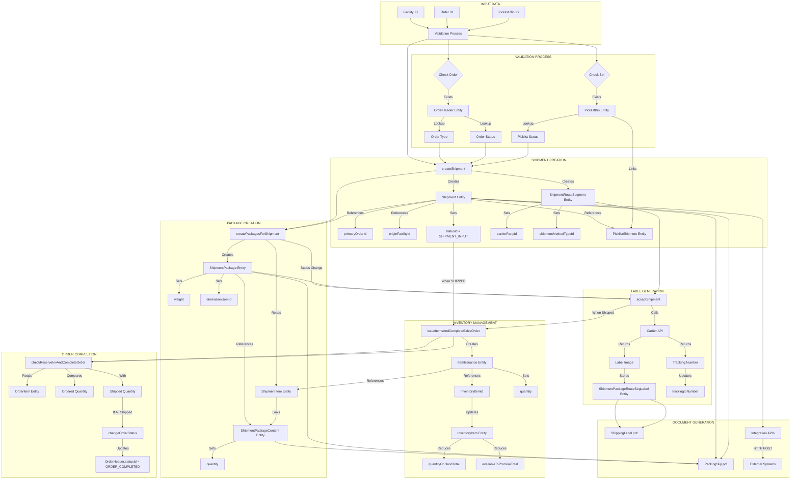

```mermaid
flowchart TD
    %% DATA FLOW DIAGRAM FOR OUTBOUND SHIPMENT PROCESS
    
    subgraph "INPUT DATA"
        in1[Picklist Bin ID] --> val[Validation Process]
        in2[Order ID] --> val
        in3[Facility ID] --> val
    end
    
    subgraph "VALIDATION PROCESS"
        val --> check1{Check Bin}
        val --> check2{Check Order}
        
        check1 --> |Exists| bin1[PicklistBin Entity]
        bin1 --> |Lookup| bin2[Picklist Status]
        
        check2 --> |Exists| ord1[OrderHeader Entity]
        ord1 --> |Lookup| ord2[Order Status]
        ord1 --> |Lookup| ord3[Order Type]
    end
    
    subgraph "SHIPMENT CREATION"
        bin2 --> ship1[createShipment]
        ord2 --> ship1
        ord3 --> ship1
        
        ship1 --> |Creates| s1[Shipment Entity]
        s1 --> |References| s2[primaryOrderId]
        s1 --> |References| s3[originFacilityId]
        s1 --> |Sets| s4[statusId = SHIPMENT_INPUT]
        
        ship1 --> |Creates| r1[ShipmentRouteSegment Entity]
        r1 --> |Sets| r2[carrierPartyId]
        r1 --> |Sets| r3[shipmentMethodTypeId]
        
        bin1 --> |Links| ps1[PicklistShipment Entity]
        s1 --> |References| ps1
    end
    
    subgraph "PACKAGE CREATION" 
        s1 --> pkg1[createPackagesForShipment]
        
        pkg1 --> |Reads| si1[ShipmentItem Entity]
        pkg1 --> |Creates| sp1[ShipmentPackage Entity]
        sp1 --> |Sets| sp2[weight]
        sp1 --> |Sets| sp3[dimensionUomId]
        
        si1 --> |Links| spc1[ShipmentPackageContent Entity]
        sp1 --> |References| spc1
        spc1 --> |Sets| spc2[quantity]
    end
    
    subgraph "LABEL GENERATION"
        sp1 --> lbl1[acceptShipment]
        r1 --> lbl1
        
        lbl1 --> |Calls| api1[Carrier API]
        api1 --> |Returns| api2[Label Image]
        api1 --> |Returns| api3[Tracking Number]
        
        api2 --> |Stores| lbl2[ShipmentPackageRouteSegLabel Entity]
        api3 --> |Updates| r4[trackingIdNumber]
    end
    
    subgraph "INVENTORY MANAGEMENT"
        s4 --> |When SHIPPED| inv1[issueItemsAndCompleteSalesOrder]
        
        inv1 --> |Creates| ii1[ItemIssuance Entity]
        ii1 --> |References| si1
        ii1 --> |References| inv2[inventoryItemId]
        ii1 --> |Sets| ii2[quantity]
        
        inv2 --> |Updates| inv3[InventoryItem Entity]
        inv3 --> |Reduces| inv4[quantityOnHandTotal]
        inv3 --> |Reduces| inv5[availableToPromiseTotal]
    end
    
    subgraph "ORDER COMPLETION"
        inv1 --> oc1[checkReserveInvAndCompleteOrder]
        
        oc1 --> |Reads| oc2[OrderItem Entity]
        oc1 --> |Compares| oc3[Ordered Quantity]
        oc1 --> |With| oc4[Shipped Quantity]
        
        oc4 --> |If All Shipped| oc5[changeOrderStatus]
        oc5 --> |Updates| oc6[OrderHeader.statusId = ORDER_COMPLETED]
    end
    
    subgraph "DOCUMENT GENERATION"
        s1 --> doc1[PackingSlip.pdf]
        sp1 --> doc1
        spc1 --> doc1
        
        lbl2 --> doc2[ShippingLabel.pdf]
        
        s1 --> doc3[Integration APIs]
        doc3 --> |HTTP POST| doc4[External Systems]
    end
    
    %% CONNECTION LINES
    val --> ship1
    ship1 --> pkg1
    pkg1 -->|Status Change| lbl1
    lbl1 -->|When Shipped| inv1
    inv1 --> oc1
    s1 --> doc1
    lbl2 --> doc2
``` 
