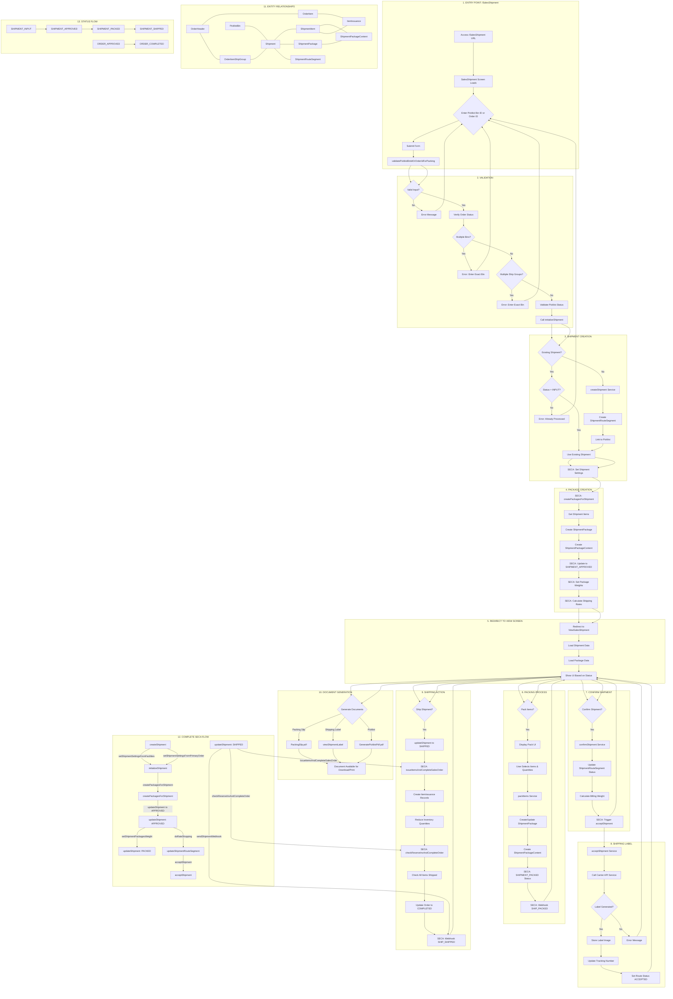

```mermaid
graph TD
    %% MAIN SECTIONS
    subgraph "1. ENTRY POINT: /SalesShipment"
        A1[Access /SalesShipment URL] --> A2[SalesShipment Screen Loads]
        A2 --> A3{Enter Picklist Bin ID or Order ID}
        A3 --> A4[Submit Form]
        A4 --> A5[validatePicklistBinIdOrOrderIdForPacking]
    end

    subgraph "2. VALIDATION"
        A5 --> B1{Valid Input?}
        B1 -->|No| B2[Error Message]
        B2 --> A3
        B1 -->|Yes| B3[Verify Order Status]
        B3 --> B4{Multiple Bins?}
        B4 -->|Yes| B5[Error: Enter Exact Bin]
        B5 --> A3
        B4 -->|No| B6{Multiple Ship Groups?}
        B6 -->|Yes| B7[Error: Enter Exact Bin]
        B7 --> A3
        B6 -->|No| B8[Validate Picklist Status]
        B8 --> B9[Call initializeShipment]
    end

    subgraph "3. SHIPMENT CREATION"
        B9 --> C1{Existing Shipment?}
        C1 -->|Yes| C2{Status = INPUT?}
        C2 -->|No| C3[Error: Already Processed]
        C3 --> A3
        C2 -->|Yes| C7[Use Existing Shipment]
        C1 -->|No| C4[createShipment Service]
        C4 --> C5[Create ShipmentRouteSegment]
        C5 --> C6[Link to Picklist]
        C6 --> C7
        C7 --> C8[SECA: Set Shipment Settings]
    end

    subgraph "4. PACKAGE CREATION"
        C8 --> D1[SECA: createPackagesForShipment]
        D1 --> D2[Get Shipment Items]
        D2 --> D3[Create ShipmentPackage]
        D3 --> D4[Create ShipmentPackageContent]
        D4 --> D5[SECA: Update to SHIPMENT_APPROVED]
        D5 --> D6[SECA: Set Package Weights]
        D6 --> D7[SECA: Calculate Shipping Rates]
    end

    subgraph "5. REDIRECT TO VIEW SCREEN"
        D7 --> E1[Redirect to ViewSalesShipment]
        E1 --> E2[Load Shipment Data]
        E2 --> E3[Load Package Data]
        E3 --> E4[Show UI Based on Status]
    end

    subgraph "6. PACKING PROCESS"
        E4 --> F1{Pack Items?}
        F1 -->|Yes| F2[Display Pack UI]
        F2 --> F3[User Selects Items & Quantities]
        F3 --> F4[packItems Service]
        F4 --> F5[Create/Update ShipmentPackage]
        F5 --> F6[Create ShipmentPackageContent]
        F6 --> F7[SECA: SHIPMENT_PACKED Status]
        F7 --> F8[SECA: Webhook SHIP_PACKED]
        F8 --> E4
    end

    subgraph "7. CONFIRM SHIPMENT"
        E4 --> G1{Confirm Shipment?}
        G1 -->|Yes| G2[confirmShipment Service]
        G2 --> G3[Update ShipmentRouteSegment Status]
        G3 --> G4[Calculate Billing Weight]
        G4 --> G5[SECA: Trigger acceptShipment]
        G5 --> E4
    end

    subgraph "8. SHIPPING LABEL"
        G5 --> H1[acceptShipment Service]
        H1 --> H2[Call Carrier API Service]
        H2 --> H3{Label Generated?}
        H3 -->|Yes| H4[Store Label Image]
        H4 --> H5[Update Tracking Number]
        H5 --> H6[Set Route Status ACCEPTED]
        H6 --> E4
        H3 -->|No| H7[Error Message]
        H7 --> E4
    end

    subgraph "9. SHIPPING ACTION"
        E4 --> I1{Ship Shipment?}
        I1 -->|Yes| I2[updateShipment to SHIPPED]
        I2 --> I3[SECA: issueItemsAndCompleteSalesOrder]
        I3 --> I4[Create ItemIssuance Records]
        I4 --> I5[Reduce Inventory Quantities]
        I5 --> I6[SECA: checkReserveInvAndCompleteOrder]
        I6 --> I7[Check All Items Shipped]
        I7 --> I8[Update Order to COMPLETED]
        I8 --> I9[SECA: Webhook SHIP_SHIPPED]
        I9 --> E4
    end

    subgraph "10. DOCUMENT GENERATION"
        E4 --> J1{Generate Documents}
        J1 -->|Packing Slip| J2[PackingSlip.pdf]
        J1 -->|Shipping Label| J3[viewShipmentLabel]
        J1 -->|Picklist| J4[GeneratePicklistPdf.pdf]
        J2 --> J5[Document Available for Download/Print]
        J3 --> J5
        J4 --> J5
    end

    %% ENTITY RELATIONSHIPS
    subgraph "11. ENTITY RELATIONSHIPS"
        K1[OrderHeader]
        K2[OrderItem]
        K3[OrderItemShipGroup]
        K4[Shipment]
        K5[ShipmentItem]
        K6[ShipmentPackage]
        K7[ShipmentPackageContent]
        K8[ShipmentRouteSegment]
        K9[ItemIssuance]
        K10[PicklistBin]
        
        K1 --- K2
        K1 --- K3
        K3 --- K4
        K4 --- K5
        K4 --- K6
        K5 --- K7
        K6 --- K7
        K4 --- K8
        K5 --- K9
        K2 --- K9
        K10 --- K4
    end

    %% SECA FLOW
    subgraph "12. COMPLETE SECA FLOW"
        L1[createShipment]
        L2[initializeShipment]
        L3[createPackagesForShipment]
        L4[updateShipment: APPROVED]
        L5[updateShipment: PACKED]
        L6[updateShipmentRouteSegment]
        L7[acceptShipment]
        L8[updateShipment: SHIPPED]
        
        L1 -->|setShipmentSettingsFromFacilities| L2
        L1 -->|setShipmentSettingsFromPrimaryOrder| L2
        L2 -->|createPackagesForShipment| L3
        L3 -->|updateShipment to APPROVED| L4
        L4 -->|setShipmentPackagesWeight| L5
        L4 -->|doRateShopping| L6
        L6 -->|acceptShipment| L7
        L8 -->|issueItemsAndCompleteSalesOrder| I3
        L8 -->|checkReserveInvAndCompleteOrder| I6
        L8 -->|sendShipmentWebhook| I9
    end

    %% STATUS FLOW
    subgraph "13. STATUS FLOW"
        M1[SHIPMENT_INPUT]
        M2[SHIPMENT_APPROVED]
        M3[SHIPMENT_PACKED]
        M4[SHIPMENT_SHIPPED]
        M5[ORDER_APPROVED]
        M6[ORDER_COMPLETED]
        
        M1 --> M2
        M2 --> M3
        M3 --> M4
        M5 --> M6
    end

    %% MAIN FLOW CONNECTIONS
    A5 --> B1
    B9 --> C1
    C7 --> C8
    C8 --> D1
    D7 --> E1
    E4 --> F1
    E4 --> G1
    E4 --> I1
    E4 --> J1
``` 
