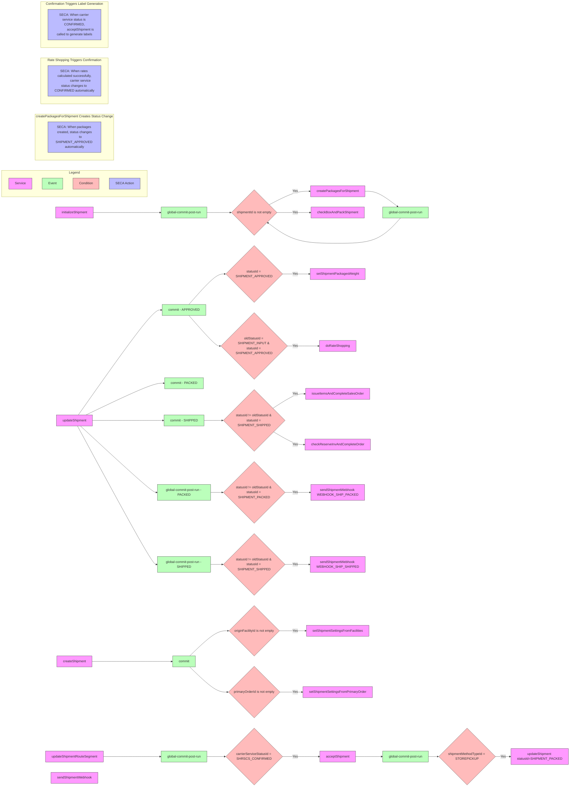

```mermaid
graph LR
    %% SECA FLOW DIAGRAM FOR OUTBOUND SHIPMENT PROCESS
    
    %% Style definitions
    classDef service fill:#f9f,stroke:#333,stroke-width:1px;
    classDef seca fill:#bbf,stroke:#333,stroke-width:1px;
    classDef event fill:#bfb,stroke:#333,stroke-width:1px;
    classDef condition fill:#fbb,stroke:#333,stroke-width:1px;
    
    %% Services
    createShipment[createShipment]:::service
    initializeShipment[initializeShipment]:::service
    createPackagesForShipment[createPackagesForShipment]:::service
    updateShipment[updateShipment]:::service
    setShipmentPackagesWeight[setShipmentPackagesWeight]:::service
    doRateShopping[doRateShopping]:::service
    updateShipmentRouteSegment[updateShipmentRouteSegment]:::service
    acceptShipment[acceptShipment]:::service
    issueItemsAndCompleteSalesOrder[issueItemsAndCompleteSalesOrder]:::service
    checkReserveInvAndCompleteOrder[checkReserveInvAndCompleteOrder]:::service
    sendShipmentWebhook[sendShipmentWebhook]:::service
    
    %% Events
    createShipment_commit[commit]:::event
    initializeShipment_commit[global-commit-post-run]:::event
    createPackagesForShipment_commit[global-commit-post-run]:::event
    updateShipment_commit1[commit - APPROVED]:::event
    updateShipment_commit2[commit - PACKED]:::event
    updateShipment_commit3[commit - SHIPPED]:::event
    updateShipment_postrun1[global-commit-post-run - PACKED]:::event
    updateShipment_postrun2[global-commit-post-run - SHIPPED]:::event
    updateShipmentRouteSegment_commit[global-commit-post-run]:::event
    
    %% Conditions
    cond1{originFacilityId is not empty}:::condition
    cond2{primaryOrderId is not empty}:::condition
    cond3{shipmentId is not empty}:::condition
    cond4{statusId = SHIPMENT_APPROVED}:::condition
    cond5{oldStatusId = SHIPMENT_INPUT & statusId = SHIPMENT_APPROVED}:::condition
    cond6{carrierServiceStatusId = SHRSCS_CONFIRMED}:::condition
    cond7{statusId != oldStatusId & statusId = SHIPMENT_SHIPPED}:::condition
    cond8{statusId != oldStatusId & statusId = SHIPMENT_PACKED}:::condition
    
    %% Service to Event connections
    createShipment --> createShipment_commit
    initializeShipment --> initializeShipment_commit
    createPackagesForShipment --> createPackagesForShipment_commit
    updateShipment --> updateShipment_commit1
    updateShipment --> updateShipment_commit2
    updateShipment --> updateShipment_commit3
    updateShipment --> updateShipment_postrun1
    updateShipment --> updateShipment_postrun2
    updateShipmentRouteSegment --> updateShipmentRouteSegment_commit
    
    %% Event to Condition connections
    createShipment_commit --> cond1
    createShipment_commit --> cond2
    initializeShipment_commit --> cond3
    createPackagesForShipment_commit --> cond3
    updateShipment_commit1 --> cond4
    updateShipment_commit1 --> cond5
    updateShipmentRouteSegment_commit --> cond6
    updateShipment_commit3 --> cond7
    updateShipment_postrun1 --> cond8
    
    %% Condition to Service connections
    cond1 -->|Yes| setShipmentSettingsFromFacilities[setShipmentSettingsFromFacilities]:::service
    cond2 -->|Yes| setShipmentSettingsFromPrimaryOrder[setShipmentSettingsFromPrimaryOrder]:::service
    cond3 -->|Yes| createPackagesForShipment
    cond3 -->|Yes| checkBoxAndPackShipment[checkBoxAndPackShipment]:::service
    cond4 -->|Yes| setShipmentPackagesWeight
    cond5 -->|Yes| doRateShopping
    cond6 -->|Yes| acceptShipment
    cond7 -->|Yes| issueItemsAndCompleteSalesOrder
    cond7 -->|Yes| checkReserveInvAndCompleteOrder
    
    %% Webhook triggers
    cond8 -->|Yes| webhook1[sendShipmentWebhook WEBHOOK_SHIP_PACKED]:::service
    updateShipment_postrun2 --> cond9{statusId != oldStatusId & statusId = SHIPMENT_SHIPPED}:::condition
    cond9 -->|Yes| webhook2[sendShipmentWebhook WEBHOOK_SHIP_SHIPPED]:::service
    
    %% Special case for store pickup
    acceptShipment --> acceptShipment_commit[global-commit-post-run]:::event
    acceptShipment_commit --> cond10{shipmentMethodTypeId = STOREPICKUP}:::condition
    cond10 -->|Yes| updateShipment_packed[updateShipment statusId=SHIPMENT_PACKED]:::service
    
    %% Additional notes
    subgraph "Legend"
        svc[Service]:::service
        evt[Event]:::event
        con[Condition]:::condition
        sec[SECA Action]:::seca
    end
    
    subgraph "createPackagesForShipment Creates Status Change"
        note1[SECA: When packages created, status changes
              to SHIPMENT_APPROVED automatically]:::seca
    end
    
    subgraph "Rate Shopping Triggers Confirmation"
        note2[SECA: When rates calculated successfully,
              carrier service status changes to CONFIRMED automatically]:::seca
    end
    
    subgraph "Confirmation Triggers Label Generation"
        note3[SECA: When carrier service status is CONFIRMED,
              acceptShipment is called to generate labels]:::seca
    end
``` 
